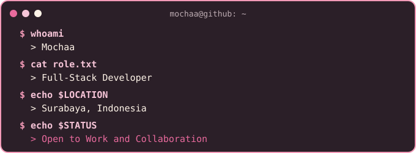
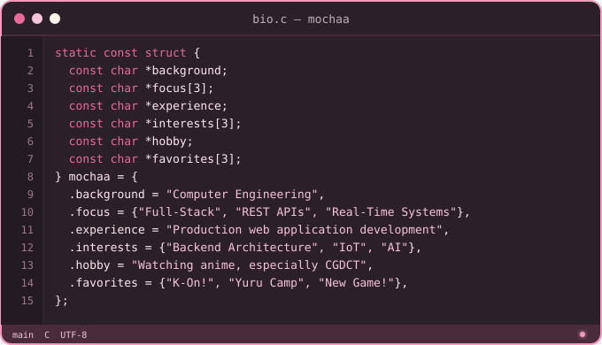
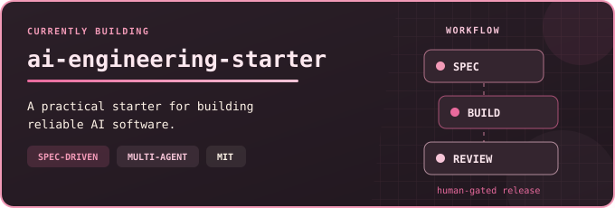
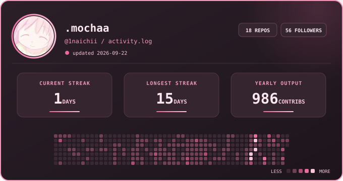

  

 

  

---

---

**`~/currently-building`**

---

**`~/languages`**

**`~/frameworks-and-libraries`**

**`~/databases-and-orm`**

**`~/runtimes-and-tools`**

**`~/platforms-and-hardware`**

---

**`~/github`**

---

**`~/connect`**

---

